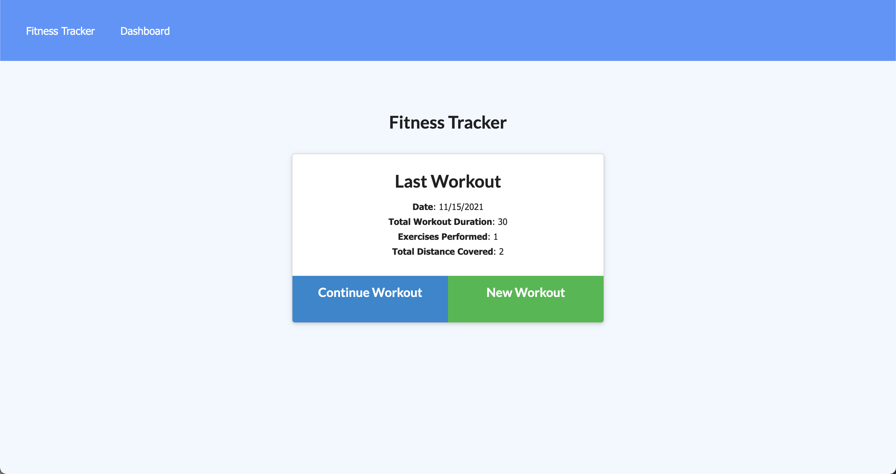

# fitness-tracker

## Description 
In this Fitness Tracker app, you are able to track your workouts. You are able to add whether you are doing a resistance work out or a cardio work out, give it a name, and fill out other details. 

## Table of Contents 
- [Installation](#installation)
- [Usage](#usage)
    - [Screenshot](#screenshot)
    - [Video](#video)
- [Author](#author)

## Installation 
- Clone repository
- Create database 
- npm install modules 
- npm start server

## Usage

## Screenshot

## Video

[Youtube video demo](https://youtu.be/s1ULQ7cXnBw)

## Author
Kalani Mojica
- [Github](https://github.com/mojikalani)
- [LinkedIn](https://www.linkedin.com/in/kalani-mojica-132042206/)